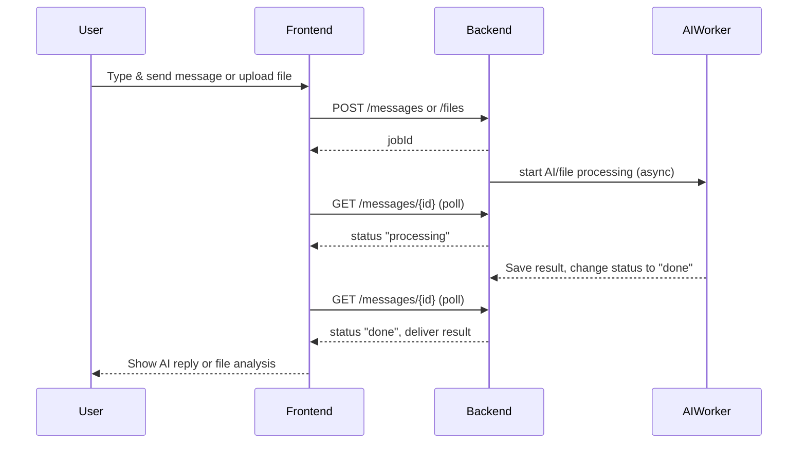

# Real-Time Chat with an AI Assistant 
*Design Document*

## 1. Overview

The goal is to build an MVP for a **real-time chat system with an AI assistant** featuring **Smart Context Management** and enterprise-grade architecture. The user sends messages or uploads files, and receives intelligent AI-generated responses with conversation memory from Google Gemini API with DeepAI backup. The stack includes a React/TypeScript frontend, a modular Python FastAPI backend, and comprehensive testing suite.


## 2. High-Level Architecture
```+--------+         +--------------------+      +------------------+      +-----------------------------+
|  User  | <---->  | Frontend (React/TS)| <--> | Backend (FastAPI)| <--> | Job Store (Memory/MongoDB)  |
+--------+         +--------------------+      +------------------+      +-----------------------------+
|
Triggers/Processes
v
+---------------+
| AI Processor  |
| (Worker/Sim.) |
+---------------+
|
(optional, for scale and real-time)
v
+--------+
| Redis  |
+--------+
```

- **Frontend:** React (TS), provides chat UI to send messages, upload files, and polls for AI responses or file results.
- **Backend:** FastAPI server providing REST endpoints and managing jobs.
- **Processing:** Real AI processing (Gemini → DeepAI → Friendly fallback) with conversation context and robust error handling.


## 3. MVP Definition

**Minimum features:**  
- User can send a message or upload a file to the AI assistant. 
- Each message or file upload is stored as a "job" and processed by real AI services. 
- The backend uses Google Gemini API (primary) with DeepAI backup for intelligent responses and file analysis.
- **Smart Context Management** automatically extracts user profiles and optimizes conversation context.
- The user sees job status ("processing", "done") and receives contextual AI responses with conversation memory.
- Chat persistence across page refreshes during active backend session.
- **Enterprise features**: 50+ unit tests, professional logging, modular architecture.


## 4. Core APIs / Endpoints

| Endpoint              | Method | Purpose                                        |
|-----------------------|--------|------------------------------------------------|
| `/messages`           | POST   | Submit user message, create a job, return job ID|
| `/files`              | POST   | Upload a file, create a processing job, return job ID|
| `/messages/{id}`      | GET    | Get status and result of a given message job    |
| `/chat/history`       | GET    | Get all messages/files for session persistence   |
| `/chat/clear`         | DELETE | Clear all messages and files from memory        |


## 5. Sequence: Sync vs Async Flow

- **Synchronous (Sync)**
  - When the frontend sends a message (POST `/messages`), the backend immediately returns a job ID.
  - When frontend checks status (GET `/messages/{id}`), it immediately gets the current status/result.
- **Asynchronous (Async)**
  - The AI services (Gemini/DeepAI) generate responses in the **background** with conversation context, so the response is not instant in the original POST.

**Sequence Flow:**
```

Step 1: User sends message OR uploads file and receives job ID
--------------------------------------------------------------

User
|
|---> POST /messages or POST /files
|           |
|           v
|     Backend (creates job & returns ID)
|<----------|
(User now has job ID)

|
v

Step 2: AI or file analysis runs in background (Asynchronous)
-------------------------------------------------------------

(Background AI processing: Gemini API → DeepAI backup → Friendly fallback)
|
v

Step 3: User polls for status and receives results (Synchronous)
----------------------------------------------------------------

User
|
|<--- Polls GET /messages/{id} --- Backend (shows status/result)
|
(Repeated until processing is complete)
```
### Sequence Diagram



## 6. Design Considerations

### a.  **Scalability**

- **MVP:**  In-memory datastore, single FastAPI process; suitable for testing.
- **Production:**  Use persistent DB (e.g., MongoDB, Redis) and task queues (Celery, RQ).
- For high scale real-time feature we would use **MongoDB** as the primary persistent store and add **Redis** for caching, pub/sub, and task queues. This combination keeps permanent data safe in MongoDB while leveraging Redis for high-performance, real-time operations as the application grows.

### b.  **Reliability**

- Idempotent job creation using unique job/message/file IDs.
- Define clear job status (`pending`,  `processing`,  `done`,  `error`).
- For production: Retry mechanism/Dead-letter queue (DLQ) for failed tasks.

### c.  **Observability**

- **MVP:**  Use basic print statements.
- **Production:**  Use logging frameworks, collect metrics for request handling and errors.

### d.  **Security & Privacy**

- Validate all input.
- Securely limit and validate file types and sizes.
- Use HTTPS and authentication in production.
- Handle and redact any PII in logs.

**File Upload Error Handling & Security**

- **File Type Validation:**
  Only allow uploads of permitted file types (e.g., restrict to `.txt`, `.pdf`, `.jpg`, etc. as needed for the use case). Reject and return a clear error for disallowed file extensions or MIME types.
- **File Size Limits:**
  Enforce a maximum file size on the backend. Reject files exceeding this size with an informative error to the user.
- **Malicious File Protection:**
  
  - Treat all uploaded files as untrusted.
  - Store uploaded files outside the static/public directory and never serve them back directly.
  - For production, consider scanning files for viruses or malware (e.g., using [ClamAV](https://www.clamav.net/) or a cloud service).
- **Randomized Filenames/Paths:**
  Store uploaded files with randomized, non-guessable names and in dedicated directories (not user-provided filenames), to prevent overwriting and path traversal attacks.
- **Temporary Storage & Clean-up:**
  
  - If files are processed and no longer needed, delete them after processing is done.
  - Periodically clean up orphaned or unfinished uploads.
- **Access Control:**
  
  - Ensure only authenticated and authorized users can upload files (in production).
  - Prevent directory traversal in file paths (sanitize input).
- **Error Handling:**
  
  - Clearly indicate to users any upload errors (type, size, virus detected, etc.).
  - Log file upload errors (without including PII or raw file content in logs).
  - Return appropriate HTTP errors (`413` for file too large, `415` for unsupported media type, etc.).
  - Handle backend exceptions to avoid server crashes on bad file input.
- **Sensitive Data:**
  
  - Do not log file content or sensitive metadata.
  - If files may contain sensitive info, encrypt files at rest or only store processed summaries.
- **Example Error Response Structure:**
  
  ```json
  {
    "success": false,
    "error": "File type not supported. Allowed types: pdf, txt, jpg."
  }
  ```

### e.  **Cost Awareness**

- MVP runs locally, open source stack—minimal/no monetary cost.
- For production: Track cloud/API costs if scaling.

### f.  **AI Integration**

- **Primary AI**: Google Gemini 1.5 Flash (requires API key)
- **Backup AI**: DeepAI API (optional, for redundancy)
- **Fallback**: Friendly user messages when both APIs unavailable
- **Context**: AI receives conversation history for contextual responses
- **Smart Context Management**: Multi-factor scoring, user profile extraction, 60-80% token optimization
- **Professional Logging**: Python logging module with component-specific loggers

### g.  **Testing & Quality Assurance**

- **Unit Testing**: 50+ tests covering models, services, context management, AI processing
- **Integration Testing**: Complete API workflows and Smart Context Management flows
- **Security Testing**: File validation, input sanitization, malicious content detection
- **Professional Setup**: Pytest with async support, fixtures, and CI-ready configuration
- **Code Quality**: Production-ready code with no debug statements, proper React Hook dependencies

### h.  **Architecture & Maintainability**

- **Modular Design**: Separated concerns (models/, services/, routes/, utils/, tests/)
- **Clean Code**: Extracted SVG components, removed console.logs, proper dependencies
- **Professional Logging**: Structured logs with component separation for debugging
- **Scalable Structure**: Ready for database persistence and horizontal scaling

## 7. Development Roadmap

| Phase    | Focus                                                    |
|----------|----------------------------------------------------------|
| MVP ✅    | End-to-end flow, real AI (Gemini+DeepAI), polling, in-memory storage, chat persistence|
| Enhanced ✅ | Beautiful UI, robust error handling, file uploads, conversation memory |
| Enterprise ✅ | Smart Context Management, 50+ tests, professional logging, modular architecture |
| Production ✅ | Clean code, no debug statements, proper dependencies, error showcases |
| Scale    | Add DB persistence, async task queues, authentication    |
| Prod     | WebSockets, microservices, monitoring dashboards, CI/CD  |


